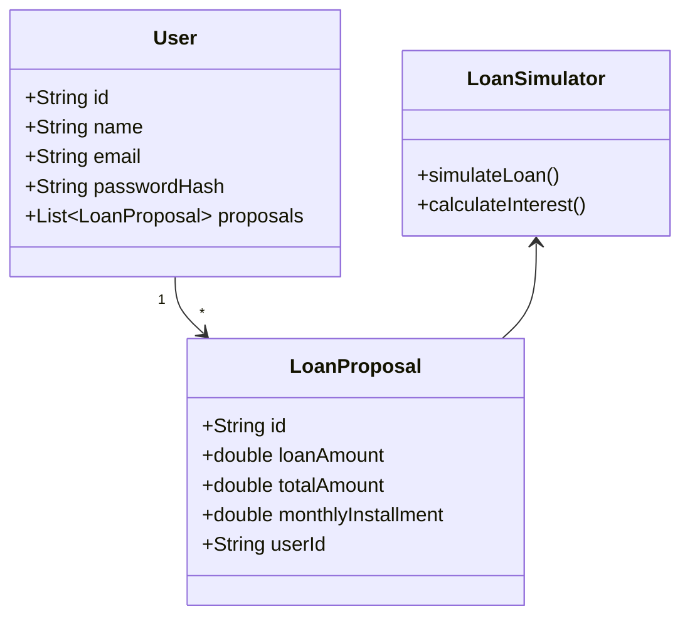

# Sistema de Simulação e Proposta de Empréstimos

## Descrição do Sistema  
O sistema de Simulação e Proposta de Empréstimos foi projetado para oferecer aos usuários uma experiência eficiente e segura ao realizar simulações de empréstimos e receber propostas personalizadas. Com funcionalidades modernas e escaláveis, ele integra diversos serviços para atender aos requisitos de performance, manutenibilidade e segurança.  

---

## Funcionalidades Principais  
1. **Cadastro de Usuário**  
   - Permite que novos usuários criem suas contas, armazenando informações de forma segura com autenticação baseada em JWT.  

2. **Login**  
   - Sistema de login robusto que valida credenciais e emite tokens de autenticação.  

3. **Simulação de Empréstimos**  
   - Os usuários podem inserir dados financeiros e realizar simulações baseadas em taxas de juros específicas para diferentes faixas etárias.  

4. **Propostas de Empréstimos**  
   - Geração de propostas personalizadas com detalhes como valor total a ser pago, parcelas mensais e juros totais.  

5. **Consulta de propostas de Empréstimos**  
   - Consulta de propostas personalizadas com detalhes como valor total a ser pago, parcelas mensais e juros totais.  

6. **Escalabilidade e Alta Disponibilidade**  
   - A arquitetura baseada em AWS Lambda e Kafka garante suporte a alta volumetria de usuários e simulações.  

---

## Arquitetura  
O sistema utiliza uma abordagem serverless baseada na AWS para proporcionar eficiência e escalabilidade:  
- **Frontend**: Interface de usuário conectada via API Gateway.  
- **Backend**: Funções AWS Lambda escritas em Kotlin, que realizam cálculos, validações e integração com serviços externos.  
- **Mensageria**: Kafka é utilizado para gerenciar eventos assíncronos, como a criação de propostas e notificações.  
- **Banco de Dados**: Utilização do AWS RDS (PostgreSQL) para armazenamento seguro de dados de usuários e simulações.  

---

## Segurança e Boas Práticas  
- **Autenticação e Autorização**: Implementação de JWT para controle de acesso seguro.  
- **Criptografia**: Senhas armazenadas com hashing (ex: BCrypt).  
- **Validação de Dados**: Todas as entradas são validadas antes de serem processadas, evitando vulnerabilidades como injeção de SQL.  

---

## Diferenciais  
- **Gerenciamento de Alta Volumetria**: Suporte a múltiplas simulações em uma única requisição, otimizando o desempenho com processamento assíncrono.  
- **Documentação Automatizada**: Todos os endpoints são documentados utilizando Swagger.  
- **Diagramação Completa**: Diagramação clara de arquitetura, classes e endpoints utilizando Mermaid.  

### **1. Arquitetura do Sistema**

#### Diagrama de Alto Nível:
```mermaid
graph TB
    %% Definição dos componentes principais
    subgraph Frontend
        user_interface[Interface do Usuário]
    end

    subgraph AWS
        api_gateway[Api Gateway]
        subgraph User_Service
          create_user_service[Serviço de criação do usuário]
        end
        subgraph Auth
          auth_service[Serviço de Autenticação]
          subgraph Lambda
              loan_simulator_service[Serviço de Simulação de Empréstimos]
              consumer_proposal_service[Serviço de processamento da Fila para gerar a proposta]
              find_proposal_service[Serviço de busca da proposta de Empréstimos]
          end
        end
    end
    subgraph Mensageria
        SQS[Fila SQS]
    end

    subgraph Bancos_de_Dados
        users_table[Tabela de Usuários]
        loans_table[Tabela de Empréstimos]
    end

    %% Conexões entre os serviços
    user_interface --> api_gateway:::highlighted
    api_gateway --> Auth:::highlighted
    api_gateway --> User_Service:::highlighted
    create_user_service --> users_table
    auth_service --> users_table
    loan_simulator_service --> SQS
    SQS --> consumer_proposal_service
    consumer_proposal_service --> loans_table
    find_proposal_service --> loans_table

    %% Classes estilizadas para os serviços e conexões
    classDef highlighted fill:#f96,stroke:#333,stroke-width:2px;
    classDef secured fill:#6cf,stroke:#333,stroke-width:2px;
    class api_gateway,loan_simulator highlighted
    class auth_service secured
````
Esse diagrama destaca os componentes principais e como eles interagem.

### **2. Fluxo de Cadastro Usuário**

#### Diagrama de Sequência:
````mermaid
sequenceDiagram
    participant UI as Interface do Usuário
    participant APIGW as API Gateway
    participant CreateUser as Serviço de Criação de Usuário
    participant DB as Tabela de Usuários
    
    UI->>APIGW: Envia dados de cadastro
    APIGW->>CreateUser: Chama o Serviço de Criação de Usuário
    CreateUser->>DB: Verifica dados na Tabela de Usuários
    CreateUser->>DB: Armazena dados do usuário
    DB-->>CreateUser: Confirma armazenamento
    CreateUser->>APIGW: Retorna sucesso no cadastro
    APIGW->>UI: Confirma cadastro de usuário

````

### **3. Fluxo de Cadastro Login**

#### Diagrama de Sequência:
````mermaid
sequenceDiagram
    participant UI as Interface do Usuário
    participant APIGW as API Gateway
    participant Auth as Serviço de Autenticação
    participant DB as Tabela de Usuários
    
    UI->>APIGW: Envia dados de login (usuário e senha)
    APIGW->>Auth: Chama o Serviço de Autenticação para validar credenciais
    Auth->>DB: Verifica dados na Tabela de Usuários
    DB-->>Auth: Retorna resultado da verificação
    Auth-->>APIGW: Retorna status da autenticação (sucesso ou falha)
    APIGW-->>UI: Retorna resposta (usuário autenticado ou erro)
````

### **4. Fluxo de Simulação de emprestimo**

#### Diagrama de Sequência:
````mermaid
sequenceDiagram
    participant UI as Interface do Usuário
    participant APIGW as API Gateway
    participant LoanSim as Serviço de Simulação de Empréstimos
    participant SQS as Fila SQS
    participant Consumer as Serviço de Processamento da Fila
    participant DB as Tabela de Empréstimos

    UI->>APIGW: Envia dados de simulação de empréstimo
    APIGW->>LoanSim: Chama o Serviço de Simulação de Empréstimos
    LoanSim->>SQS: Envia dados de simulação para a Fila SQS
    SQS-->>Consumer: Serviço de Processamento da Fila consome os dados
    Consumer->>DB: Armazena ou processa a proposta de empréstimo
    Consumer-->>LoanSim: Retorna status do processamento
    LoanSim-->>APIGW: Retorna resultado da simulação de empréstimo
    APIGW-->>UI: Retorna resultado da simulação (aprovação ou reprovação)
````

```mermaid
sequenceDiagram
    participant UI as Interface do Usuário
    participant APIGW as API Gateway
    participant FindProposal as Serviço de Consulta de Proposta
    participant DB as Tabela de Empréstimos
    
    UI->>APIGW: Envia requisição com ID da proposta
    APIGW->>FindProposal: Chama o Serviço de Consulta de Proposta
    FindProposal->>DB: Consulta dados na Tabela de Empréstimos
    DB-->>FindProposal: Retorna informações da proposta
    FindProposal-->>APIGW: Retorna os detalhes da proposta
    APIGW-->>UI: Retorna os dados da proposta para o usuário
```

### **Endpoints**

#### Diagrama de Endpoints:

````mermaid
graph LR
    %% Definição dos endpoints
    Simulate[POST /loan/simulate]
    Propose[GET /loan/proposal]
    Users[POST /users]
    Login[POST /auth/login]

    %% Conexões dos endpoints com o API Gateway
    Simulate -->|Entrada: Dados Financeiros| API_Gateway
    Propose -->|Mostra: Dados Personalizados após o processamento da simulação | API_Gateway
    Users -->|Cadastro de Usuário| API_Gateway
    Login -->|Credenciais do Usuário| API_Gateway

    %% Definição de componentes no diagrama
    API_Gateway[API Gateway]

    %% Estilos para os endpoints
    classDef loanSimulation fill:#9f6,stroke:#333,stroke-width:2px;
    classDef loanPropose fill:#ff9,stroke:#333,stroke-width:2px;
    classDef userCreation fill:#f96,stroke:#333,stroke-width:2px;
    classDef userLogin fill:#6cf,stroke:#333,stroke-width:2px;
    classDef apiGateway fill:#fff,stroke:#333,stroke-width:2px;

    class Simulate loanSimulation
    class Propose loanPropose
    class Users userCreation
    class Login userLogin
    class API_Gateway apiGateway

````

### Exemplos de Endpoints:

- **POST /users**: Cadastro de usuário.  
  Request Body:
```JSON
{
  "name": "João",
  "email": "joao@email.com",
  "password": "senha123"
}
```

**POST /auth/login**: Login de usuário.

Request Body:

```JSON
{
  "email": "joao@email.com",
  "password": "senha123"
}
```


- **POST /loan/simulate**: Simular empréstimo.  
  Request Body:

```json
  {
    "loanAmount": 10000,
    "birthDate": "1990-05-15",
    "paymentTerms": 24
  }
```
  
  Response:

```json
  {
    "totalAmount": 11200,
    "monthlyInstallment": 466.67,
    "totalInterest": 1200
  }
```

***

### **4. Diagrama de Classes**

#### Classes Principais (Mermaid):



### **Justificativa para o uso do AWS Lambda, API Gateway e DynamoDB**

#### **1. AWS Lambda:**

O **AWS Lambda** é uma solução serverless que permite executar código sem a necessidade de provisionar ou gerenciar servidores. A utilização do Lambda oferece várias vantagens:

- **Escalabilidade Automática:** O Lambda escala automaticamente com base no volume de requisições. Isso significa que, independentemente da quantidade de usuários ou requisições, o serviço continuará a operar de forma eficiente, sem precisar de ajuste manual da infraestrutura.

- **Custo-Efetividade:** O modelo de precificação do Lambda é baseado no consumo real de recursos, ou seja, você paga apenas pelo tempo de execução do código, sem a necessidade de manter instâncias ociosas. Isso reduz significativamente os custos em comparação com servidores tradicionais.

- **Desempenho e Baixa Latência:** O Lambda permite que funções sejam executadas em segundos, oferecendo alta performance com baixa latência, o que é ideal para aplicações que exigem respostas rápidas, como sistemas de processamento de empréstimos em tempo real.

- **Fácil Integração com Outros Serviços AWS:** Lambda se integra facilmente com outros serviços da AWS, como o API Gateway e DynamoDB, proporcionando uma arquitetura sem servidor simples e eficiente.

#### **2. API Gateway:**

O **Amazon API Gateway** é um serviço gerenciado para criar, publicar, manter, monitorar e proteger APIs em qualquer escala. As vantagens de usar o API Gateway incluem:

- **Gerenciamento de APIs:** O API Gateway permite criar e gerenciar APIs RESTful de maneira simples, controlando o tráfego de entrada e saída entre o cliente e os serviços backend (como o AWS Lambda). Ele também permite a definição de endpoints, manipulação de dados e autorização.

- **Segurança e Autenticação:** Com o API Gateway, você pode aplicar segurança nas suas APIs por meio da autenticação e autorização integrada com o AWS Cognito ou outras soluções de autenticação baseadas em JWT. Isso ajuda a proteger o acesso aos dados sensíveis, como informações financeiras.

- **Escalabilidade e Alta Disponibilidade:** O API Gateway é projetado para lidar com grandes volumes de tráfego de APIs, garantindo alta disponibilidade e tolerância a falhas. Ele se ajusta automaticamente a picos de tráfego, oferecendo suporte sem a necessidade de configurações adicionais.

- **Monitoração e Analytics:** O API Gateway oferece métricas detalhadas e logs, facilitando o monitoramento e a depuração da API. Isso ajuda na análise de performance, tráfego e segurança, permitindo ajustes conforme necessário.

#### **3. DynamoDB:**

O **Amazon DynamoDB** é um banco de dados NoSQL totalmente gerenciado, que oferece baixa latência e alta escalabilidade. As razões para usar o DynamoDB são:

- **Alta Performance e Baixa Latência:** O DynamoDB oferece leitura e escrita de dados com latência de milissegundos, o que é fundamental para sistemas que exigem respostas rápidas, como simulações de empréstimos e propostas financeiras.

- **Escalabilidade Horizontal:** O DynamoDB pode escalar automaticamente para atender às necessidades de tráfego de forma contínua, sem a necessidade de configuração manual de instâncias ou capacidade de armazenamento. Isso é ideal para sistemas que podem ter picos de uso, como sistemas de crédito e bancos digitais.

- **Simplicidade e Facilidade de Gerenciamento:** Por ser um banco de dados totalmente gerenciado, o DynamoDB elimina a complexidade de gerenciar servidores de banco de dados, backups e manutenção de performance. Isso reduz a carga operacional e permite que a equipe de desenvolvimento se concentre mais na lógica do negócio.

- **Integração com AWS Lambda:** O DynamoDB se integra perfeitamente com o AWS Lambda, permitindo que funções Lambda sejam acionadas automaticamente em resposta a eventos, como a inserção de novos dados ou modificações nas tabelas do banco.

- **Modelo Flexível de Dados:** O DynamoDB permite o uso de um modelo de dados altamente flexível, ideal para armazenar dados como informações de usuários, propostas de empréstimos e transações financeiras, com fácil adaptação a mudanças de requisitos.

***

### **Conclusão:**

Usar **AWS Lambda**, **API Gateway** e **DynamoDB** oferece uma solução eficiente, escalável e de baixo custo para sistemas baseados em serviços serverless. A combinação desses serviços permite um desenvolvimento ágil, com alto desempenho e disponibilidade, além de simplificar o gerenciamento da infraestrutura, garantindo um sistema seguro e fácil de monitorar.
